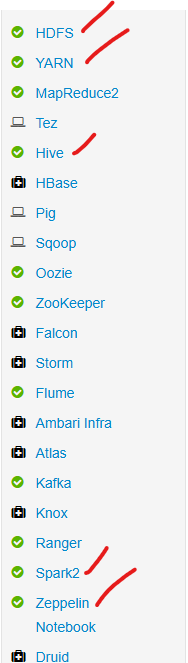

# 1. Instalación de Hortonworks Sandbox en VirtualBox

---

## 0. Requisitos y Software requerido

- **Sistema Operativo:** Windows, macOS o Linux  
- **CPU:** Al menos 4 núcleos  
- **Memoria RAM dedicada al clúster:** Mínimo 8 GB  
- **Almacenamiento:** 65 GB de espacio libre en disco como mínimo    

---

## 1. Instalación de VirtualBox

Ya se contaba con el VirtualBox Instalado

---

## 2. Importación del HDP Sandbox

## 4. Asignar recursos recomendados:

Falta Evidencia

---

## 5. Configuración de red

---

## 6. Primer arranque de la VM 

## 7. Cambiar la contraseña del usuario `root` 

## 8. Verificación del usuario por defecto:  
   - **Usuario:** `maria_dev`  
   - **Contraseña:** `maria_dev`

## 9. Verificar que los servicios principales estén activos:  
   - HDFS  
   - YARN  
   - Hive  
   - Spark  
   - Zeppelin

---

## 10. Comprobación inicial

---
# 2. EXPLORANDO AMBARI
## 1. Dashboards

## 2. HOSTS

## 3. ALERTAS

---
# 3. Subida del archivo

