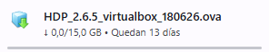
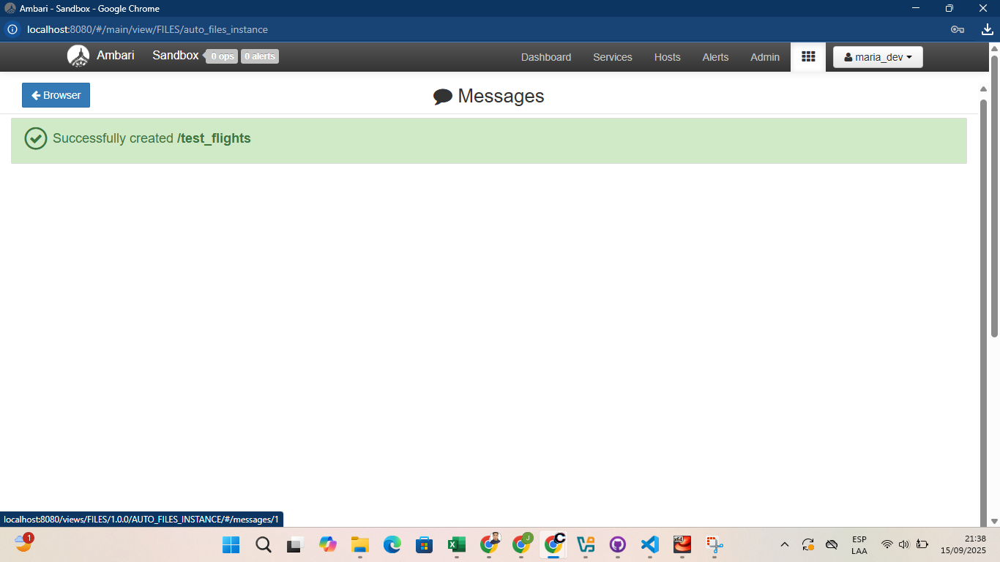

# 1. Instalación de Hortonworks Sandbox en VirtualBox

### 1.1. Requisitos y Software requerido
El dispositivo usado cuenta con los requisitos mínimos:
- **Sistema Operativo:** Windows, macOS o Linux  
- **CPU:** Al menos 4 núcleos  
- **Memoria RAM dedicada al clúster:** Mínimo 8 GB  
- **Almacenamiento:** 65 GB de espacio libre en disco como mínimo    

Se procedió a descargar el Hortonworks Data Platform:

   

### 1.2. Importación del HDP Sandbox
Acorde a lo explicado se procedió a importar el OVA descargado:

   

### 1.3. Configuración de red

   

### 1.4. Primer arranque de la VM 

   
   

### 1.5. Cambiar la contraseña del usuario `root` 

   

### 1.6. Verificación del usuario por defecto:  
   - **Usuario:** `maria_dev`  
   - **Contraseña:** `maria_dev`

   
   

### 1.7. Verificar que los servicios principales estén activos:  
   - HDFS  
   - YARN  
   - Hive  
   - Spark  
   - Zeppelin

   

### 1.8. Comprobación inicial

   

---
# 2. EXPLORANDO AMBARI
### 1. Dashboards
La pantalla inicial de Ambari muestra un **DASHBOARD** con información predeterminada:

   

### 2. HOSTS
En el apartado HOSTS se pueden observar los nodos en los cuales se podría operar:

   

### 3. ALERTAS
En la pantalla de ALERTAS al inciio se muestran todos los elementos en alerta **CRÍTICA** pero esto se corrige luego de un tiempo en el que se termina de configurar:

   

---
# 3. PRUEBA INICIAL CON ARCHIVO
### 3.1. Subida del archivo 
Usando la interfaz propia de Ambari se realizó la carga del archivo `test_flights` al sistema:

   
   

Preview del archivo en el entorno de Ambari:

   

Posteriormente se generó la Tabla que recepcionará la información del archivo y se cargaron los datos:

   

### 3.2. Exploración Inicial del Archivo
Usando la herramienta de `Query` se realizó la consulta de llamado a los datos del archivo:

   

Se obtuvo el siguiente resultado:

   

