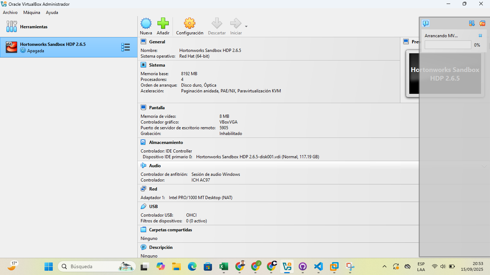
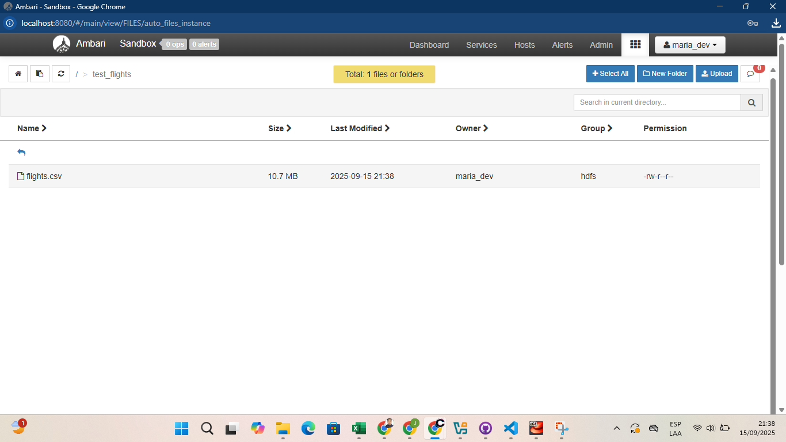

# 1. Instalación de Hortonworks Sandbox en VirtualBox

## 1.1. Requisitos y Software requerido
El dispositivo usado cuenta con los requisitos mínimos:
- **Sistema Operativo:** Windows, macOS o Linux  
- **CPU:** Al menos 4 núcleos  
- **Memoria RAM dedicada al clúster:** Mínimo 8 GB  
- **Almacenamiento:** 65 GB de espacio libre en disco como mínimo    

Se procedió a descargar el Hortonworks Data Platform:

## 1.2. Importación del HDP Sandbox

## 1.3. Asignar recursos recomendados:

Falta Evidencia

## 1.4. Configuración de red

## 1.5. Primer arranque de la VM 

## 1.6. Cambiar la contraseña del usuario `root` 

## 1.7. Verificación del usuario por defecto:  
   - **Usuario:** `maria_dev`  
   - **Contraseña:** `maria_dev`

## 1.8. Verificar que los servicios principales estén activos:  
   - HDFS  
   - YARN  
   - Hive  
   - Spark  
   - Zeppelin

## 1.9. Comprobación inicial

---
# 2. EXPLORANDO AMBARI
## 1. Dashboards

## 2. HOSTS

## 3. ALERTAS

---
# 3. Subida del archivo

